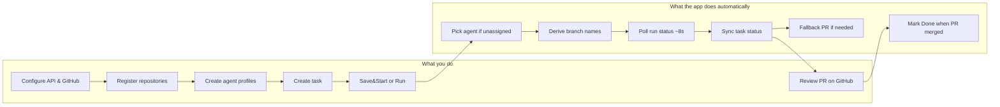

# How to use AI Team Console

A plain-language guide for operators who configure agents, create tasks, and track runs — without reading Java source or Maven commands.

## What is this app?

**AI Team Console** is a desktop control panel for coordinating AI engineering agents on your repositories. You register GitHub repos, define **agent profiles** (name, role, provider), create **tasks** with titles and acceptance criteria, and start **runs** that execute work on a dedicated git branch. The app tracks status, run logs, and pull requests so you can review outcomes on GitHub.

The primary provider is **Cursor Cloud Agents** (remote runs via the Cursor API). You can also use **Ollama** for a local git + model pipeline on your machine. Everything runs locally on your computer; configuration and state live under `~/.ai-team-console-java/`.

## Before you start

You need JDK 23, Maven, and a **Cursor API key** with Cloud Agents access. For branch pickers, fallback PR creation, and automatic “PR merged → Done” updates, sign in with **GitHub** in the app.

| Topic | Where to read more |
|--------|-------------------|
| Install, run, API key storage | [README.md](README.md) |
| Cursor Dashboard + GitHub linking for Cloud Agents | [CURSOR_CLOUD_AGENTS_SETUP.md](CURSOR_CLOUD_AGENTS_SETUP.md) |
| Logs and troubleshooting | [README.md — Logging](README.md#logging) |

This guide focuses on **what the app does** and **how tasks flow**. It does not duplicate full setup checklists.

## Quick start — your first successful run (~5 minutes)

1. **Start the app** (see [README.md](README.md)) and open **Cursor settings…** from the top bar. Paste your Cursor API key and save if you want it remembered across restarts.

2. **Open GitHub settings…** and sign in with GitHub (device flow). After sign-in, the app **imports your repositories** into the registry. Each repo gets a **name/tag** (from its display name) used when creating tasks.

3. **Agents tab** — click **Add agent**. Enter a **Name** (e.g. `Backend Dev`) and pick a **Role** (e.g. Backend Engineer). The git **branch prefix** is filled automatically as `ia-agent-<slug>` from the name. Optionally link the agent to one or more repository tags. Save.

4. **Tasks tab** — fill in:
   - **Prefix** — e.g. `BE-TASK` (editable; drives role inference)
   - **Title** and **Description** (acceptance criteria)
   - **Repositories** — select one or more tags from the registry
   - Optionally check **Assign developer** and pick an agent; otherwise leave unassigned for auto-pick

5. Click **Create task** to save a **draft**, or select the task and click **Save&Start** to save and launch immediately. On a draft row you can also click **Run** in the Actions column.

6. **Runs tab** — watch the run progress. Active runs refresh automatically about every **8 seconds**. Open the **Run log** for details, PR links, and automation messages.

7. When the run finishes, check the task status and any PR link. Review or merge on GitHub. If you are signed in with GitHub, tasks in **Waiting review** can move to **Done** automatically when the PR is merged.

## Main areas of the app

| Area | What you do there |
|------|-------------------|
| **Agents** | Create and edit agent profiles: name, role, provider (Cursor Cloud or Ollama), repository tags, branch prefix |
| **Tasks** | Create tasks, assign agents, pick repos and optional base branch, start runs |
| **Runs** | Monitor active runs, read logs, cancel or restart |
| **Cursor / Ollama / GitHub settings** (top bar) | API keys, Ollama endpoint, GitHub OAuth, repository registry, branch verification |
| **Pixel Office…** (optional) | Visual canvas showing agents at desks — synced with your agent and task lists |

## Typical workflow



In order:

1. Configure **Cursor API** (and optionally **GitHub** / **Ollama**).
2. **Register repositories** (tags and default branches) via GitHub settings.
3. Create **agent profile(s)**.
4. **Create a task** — **Create task** (draft) or **Save&Start** (edit mode).
5. **Run executes** — task moves through statuses (see below).
6. **Review outcome** (PR link if any) → task completes, or re-run via **Edit** + start.

### Multi-repo example

One task can touch **multiple repositories**: select two tags (e.g. `frontend-app` and `api-service`) when creating the task. The app sends every matching repository URL to the provider in a single run. Pick an agent whose repository tags overlap, or leave unassigned and let auto-pick find a free agent with matching tags.

### Unassigned task example

Create a `BE-TASK` with repository tag `api-service` but leave **Assign developer** unchecked. On **Save&Start**, the app picks the first **free** agent where:

- Task prefix maps to **Backend Engineer** (`BE` → Backend), and
- The agent’s repository tags include `api-service` (or the agent has no tag restriction and the task has tags — see automation section).

If the wrong agent would be chosen, assign explicitly before starting.

### Re-run / Edit

Tasks in **Done**, **Failed**, **Cancelled**, or **Waiting review** can be loaded back into the form with **Edit** in the Actions column. Change title, description, repos, or agent; **Save changes** then **Save&Start** to run again. **Started** / **Ended** timestamps reset for the new run.

## Task lifecycle and statuses

| Status | Meaning |
|--------|---------|
| **DRAFT** | Saved, not started |
| **QUEUED** | Start requested; provider is launching |
| **RUNNING** | Agent run in progress |
| **WAITING_REVIEW** | Run finished **with** a pull request URL; awaiting your review/merge on GitHub |
| **DONE** | Finished successfully (no PR, or PR merged when signed in with GitHub) |
| **FAILED** | Run ended with an error |
| **CANCELLED** | Run was cancelled (by you or the provider) |

Simple flow:

```
DRAFT → (you start) → QUEUED → RUNNING → DONE
                              ↘ FAILED / CANCELLED
RUNNING → (finished with PR URL) → WAITING_REVIEW → (PR merged on GitHub) → DONE
```

> **Note:** A Product Analyst role and prompt profile exist for specification-style work, but there is no separate `SPEC_REVIEW` status or “Accept spec” step in the current app — tasks use the statuses above like any other role.

## Roles and task prefixes

When creating a task, the **prefix** field (e.g. `BE-TASK`, `FE-TASK`) is normalized and used to infer which **role** an unassigned task needs:

| Prefix starts with | Inferred role |
|--------------------|---------------|
| `BE` | Backend Engineer |
| `FE` | Frontend Engineer |
| `QA` | QA Engineer |
| `REV` | Code Reviewer |
| `DEVOPS` | DevOps Engineer |

The prefix dropdown defaults to `BE-TASK`, `FE-TASK`, etc., but the field is **editable** — you can type any prefix (e.g. `PA-TASK14` for a Product Analyst agent you created manually).

Each agent role has a matching **operating profile** (markdown) injected into the prompt sent to the provider. The run summary may include a verification line such as `ROLE-VERIFY: Backend Engineer | TASK: BE-TASK01` when the cloud agent honors the profile — check the **Run log** to confirm.

## What happens automatically

You do **not** need to manually:

- **Branch prefix** — When creating an agent, if you leave branch prefix empty, the app sets `ia-agent-<slug>` from the agent name (e.g. `Backend Dev` → `ia-agent-backend-dev`).
- **Agent auto-pick** — For unassigned tasks, the app selects a free agent matching task prefix → role and overlapping repository tags.
- **Default base branch** — If the task does not specify a branch, the app uses the **default branch** from the repository registry entry for the task’s tags (usually `main`).
- **Head branch naming** — The git branch for the run is `{branchPrefix}/{taskKey}-{title-slug}`, sanitized for git and API limits (e.g. `ia-agent-backend-dev/be-task01-add-ttl-support`).
- **Run status polling** — Non-terminal runs refresh about every **8 seconds** while the app is open.
- **Task status sync** — Task status follows run status; a finished run **with** a PR URL moves the task to **WAITING_REVIEW**; without a PR URL → **DONE**.
- **GitHub repo import** — After GitHub sign-in, repositories are imported into the registry; use **Import my repositories now** to refresh later.
- **Fallback PR creation** — If the agent has **Auto-create PR** enabled, the run finishes without a `pullRequestUrl`, you are **signed in with GitHub**, and the head branch exists on GitHub, the app may open a PR via the GitHub API. Look for `PR automation:` lines in the run log.
- **PR merge watch** — Tasks in **WAITING_REVIEW** are checked periodically (about every 3 minutes during normal polling). When GitHub reports the PR merged, the task moves to **DONE** (requires GitHub sign-in).
- **Role-specific prompts** — Markdown from `agent-prompts/` is embedded per agent role in the task prompt.
- **Role verification logging** — When the run summary contains the expected `ROLE-VERIFY:` line, the app adds a confirmation entry to the run log (once per run).
- **Local state persistence** — Agents, tasks, runs, and the repository registry are saved to `~/.ai-team-console-java/state.json` on changes.
- **Table column sizing** — Tasks (and other tables) auto-size columns to fit content.

## What you control manually

You **must**:

- **Paste and save** your Cursor API key (and optionally save it to disk). Link **GitHub in the Cursor Dashboard** for Cloud Agents — signing in only in this app is not enough for Cursor to see your repos ([setup guide](CURSOR_CLOUD_AGENTS_SETUP.md)).
- **Create tasks** and click **Save&Start**, or **Run** on a draft row.
- **Assign an agent explicitly** when auto-pick would choose the wrong worker.
- **Review and merge PRs** on GitHub when you want changes merged.
- **Re-run failed tasks** via **Edit**, adjust if needed, then **Save&Start**.

**If GitHub is not signed in:**

- Branch dropdown refresh from GitHub may be limited.
- **Fallback PR creation** does not run — expect no automatic PR from this app; Cursor may still create one if configured.
- **PR merge watch** does not run — tasks stay in **WAITING_REVIEW** until you mark them done manually or merge outside the app’s watch.

## Pull requests and review

1. Prefer PRs returned by **Cursor** in the run status (`pullRequestUrl`).
2. If none appears, read the run log for `PR automation:` messages and see [README — If no pull request appears](README.md#if-no-pull-request-appears-after-a-successful-run).
3. Tasks with a PR link show **WAITING_REVIEW** until the PR is merged (auto) or you handle review yourself.
4. Open PR links from the Runs tab or your browser.

## Providers at a glance

### Cursor Cloud (primary)

Remote agents via Cursor’s REST API. Best for full-repo work with Cloud Agent infrastructure. Requires Cursor API key and GitHub linked in Cursor for repository access.

### Ollama (local)

Runs a local pipeline: clone repository → chat with your Ollama model → apply patches → push. Configure endpoint and model in **Ollama settings…**. Suitable when you want runs entirely on your machine without Cursor Cloud. PR fallback and merge watch behave similarly when GitHub is signed in.

## Pixel Office (optional)

Click **Pixel Office…** in the top bar for a visual view of agents at desks, reflecting current agent and task state. It is optional — all real work is still done from the Agents, Tasks, and Runs tabs.

## Secrets and data

- API keys are **not** stored in `state.json`. Saved Cursor keys go to `~/.ai-team-console-java/cursor-api.json`; GitHub tokens to `github-session.json`.
- Run logs and app logs may contain task descriptions. See [README — Logging](README.md#logging) before enabling verbose prompt logging (`AI_TEAM_LOG_PROMPT_TEXT`).

## Troubleshooting

| Symptom | What to check |
|---------|----------------|
| Run stuck or failed | **Runs** tab → run log; **README** logging section |
| No PR after success | Run log `PR automation:` lines; [README PR section](README.md#if-no-pull-request-appears-after-a-successful-run); GitHub sign-in; Cursor GitHub integration |
| Wrong role on task | Task prefix vs agent role; assign developer explicitly |
| No `ROLE-VERIFY` in log | Agent may not have echoed the profile — try another model or check Cursor settings |
| Branch / repo errors | [CURSOR_CLOUD_AGENTS_SETUP.md](CURSOR_CLOUD_AGENTS_SETUP.md) — Cursor must see the repo |
| Agent always “Working” | Wait for run to finish or cancel from **Runs** tab |

## Glossary

| Term | Meaning |
|------|---------|
| **Agent profile** | A configured worker: name, role, provider, optional repo tags, branch prefix |
| **Repository tag** | Short name from the registry (e.g. `my-api`) — select it when creating tasks |
| **Task key** | Prefix + number, e.g. `BE-TASK01` |
| **Head branch** | Git branch the agent works on and pushes |
| **Starting ref** | Base branch/ref to start from (task overrides agent/registry default) |
| **Run log** | Timestamped messages for a single run, including PR automation and role verification |

---

For build commands, API details, and developer-oriented behavior, see [README.md](README.md).
